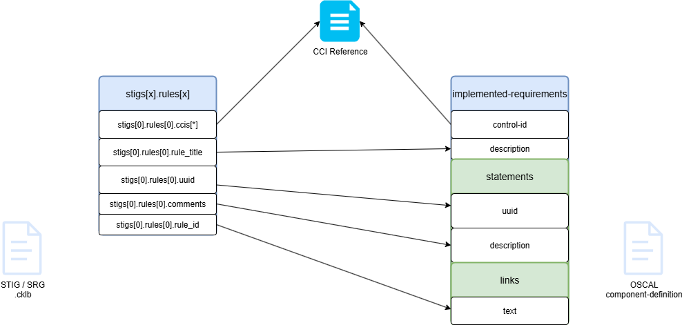

# STIG Checklist to Component Definition Mapping

Following diagram represents a possible mapping from stig cklb file to componenet definition.

# STIG to OSCAL Component Conversion

This implementation adds the ability to convert a STIG Checklist to an OSCAL Component definition.

## Command Structure

The feature will be implemented as a subcommand of the `generate` command:

